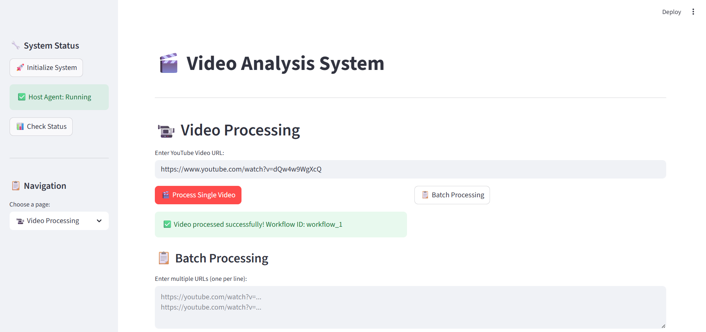
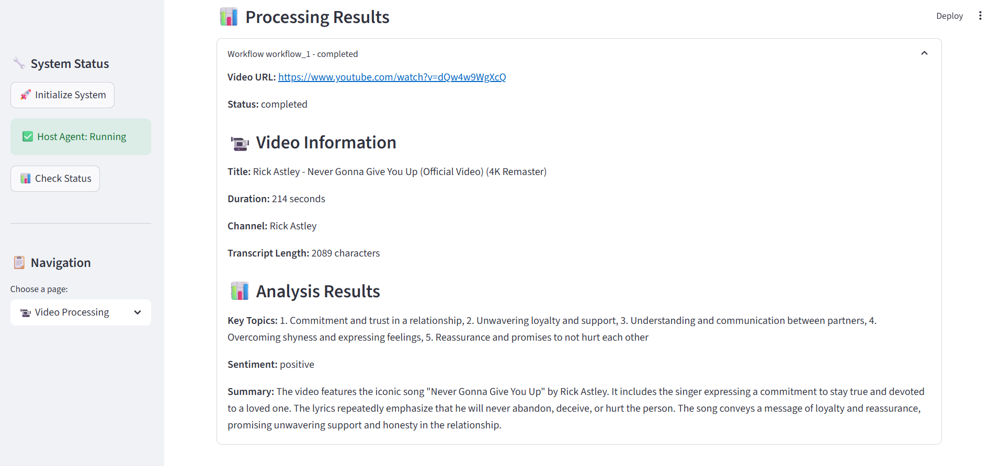
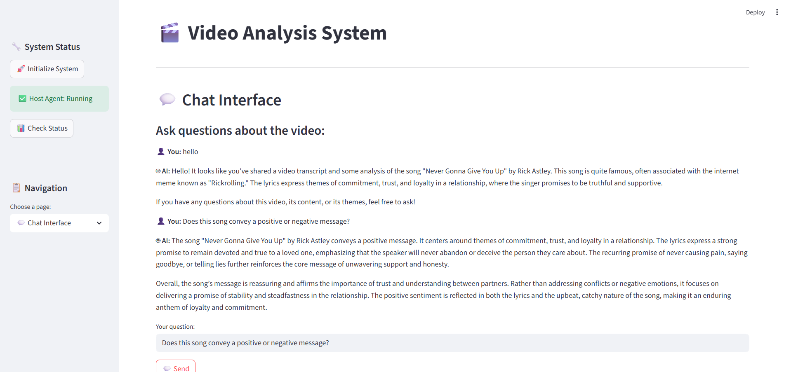
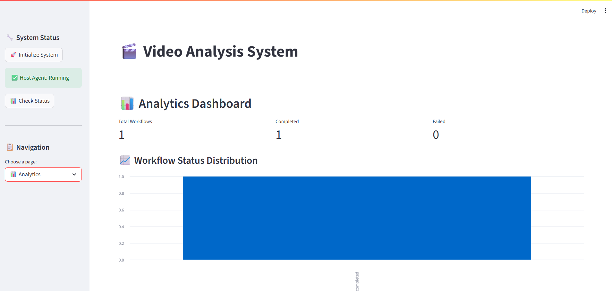

# Video Analysis System 📹

A Python-based multi-agent system that helps users analyze YouTube videos, extract insights, and provide intelligent Q&A capabilities through a modern web interface.

## Overview and Architecture Diagram

The Video Analysis System streamlines the process of video content analysis by orchestrating multiple specialized agents. The system can perform comprehensive video processing, extract transcripts, analyze content, and provide intelligent chatbot responses to user queries about the video content.

```
┌───────────────────┐    ┌─────────────────┐    ┌─────────────────┐
│       Web UI      │    │   Host Agent    │    │   Video Agent   │
│    (Streamlit)    │◄──►│ (Orchestrator)  │◄──►│  (Processing)   │
└───────────────────┘    └─────────────────┘    └─────────────────┘
                                │                        │
                                ▼                        ▼
                       ┌─────────────────┐    ┌───────────────────┐
                       │  Chatbot Agent  │    │    Video Agent    │
                       │      (Q&A)      │    │ (Content Analysis)│
                       └─────────────────┘    └───────────────────┘
```

### Video Processing & Analysis 📁
- **YouTube Integration**: Directly process YouTube videos using video URLs
- **Transcript Extraction**: Automatically extract and process video transcripts using YouTube Transcript API
- **Content Analysis**: Perform comprehensive analysis of video content using OpenAI GPT models
- **Metadata Extraction**: Extract video metadata including title, duration, view count, and channel information
- **Multi-language Support**: Handle videos in multiple languages (Vietnamese, English)

### Tool Integration 🔧
- **YouTube Data API v3**: Extract video metadata and information
- **YouTube Transcript API**: Extract video transcripts and captions
- **OpenAI API**: Power intelligent chatbot responses and content analysis
- **Streamlit**: Modern web interface framework
  
## Workflow 🚀

The system follows a structured workflow to ensure thorough video analysis:

1. **Input Validation**: Verifies YouTube URL and video accessibility
2. **Video Processing**: Extracts video metadata and information
3. **Transcript Extraction**: Generates detailed video transcripts
4. **Content Analysis**: Performs AI-powered analysis (summary, topics, sentiment)
5. **Q&A Preparation**: Prepares chatbot for user interactions
6. **Interactive Interface**: Provides web interface for user queries
7. **Response Generation**: Delivers intelligent, context-aware answers

## System Screenshots 📸

### Video Processing Interface

*The main video processing interface where users can input YouTube URLs and monitor processing progress.*

### Processing Results

*Detailed analysis results showing video metadata, transcript, and AI-generated insights.*

### Chat Interface

*Interactive chat interface for asking questions about the analyzed video content.*

### Analytics Dashboard

*Comprehensive analytics dashboard displaying video statistics and analysis metrics.*

## Installation & Setup 🛠️

### 1. Clone the Repository
```bash
git clone https://github.com/vonhatphuongahihi/Video-Analysis-System
```

### 2. Create Virtual Environment
```bash
python -m venv venv
# On Windows
venv\Scripts\activate
# On macOS/Linux
source venv/bin/activate
```

### 3. Install Dependencies
```bash
pip install -r requirements.txt
```

### 4. Configure API Keys
Create a `.env` file in the project root:
```env
OPENAI_API_KEY=your-openai-api-key
YOUTUBE_API_KEY=your-youtube-api-key
```

### 5. Run the Application
```bash
# Start the web interface
streamlit run ui/app.py

# Or run via script
python scripts/run_all.py --mode ui

# Or run full system
python scripts/run_all.py --mode full
```

## Usage Guide 📖

### Web Interface
1. **Access the UI**: Open your browser to the Streamlit interface (default: http://localhost:8501)
2. **Initialize System**: Click "Initialize System" in the sidebar
3. **Enter Video URL**: Paste a YouTube video URL in the input field
4. **Start Analysis**: Click "Process Single Video" to begin processing
5. **View Results**: Monitor progress and view analysis results
6. **Ask Questions**: Use the chat interface to ask questions about the video


### Command Line Interface
```bash
# Run different modes
python scripts/run_all.py --mode test      # Run all tests
python scripts/run_all.py --mode video     # Video agent only
python scripts/run_all.py --mode host      # Host agent only
python scripts/run_all.py --mode full      # Full system
python scripts/run_all.py --mode ui        # Streamlit interface
```
